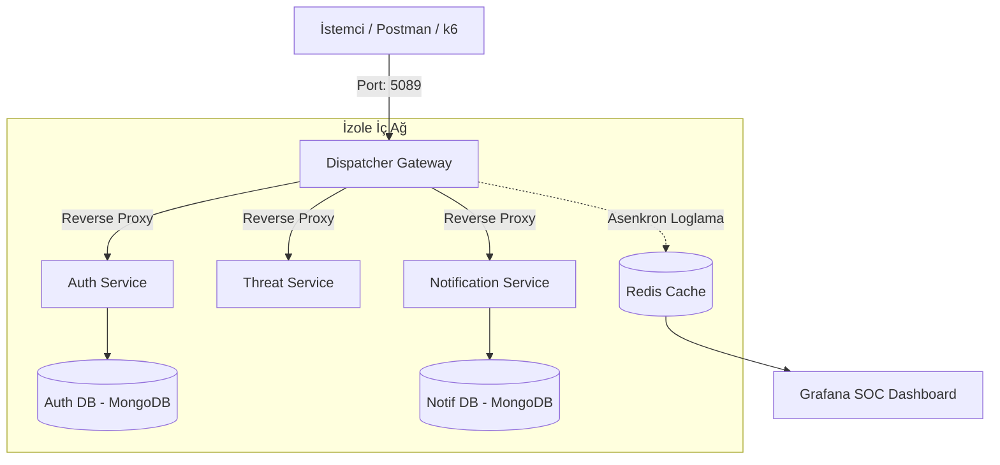
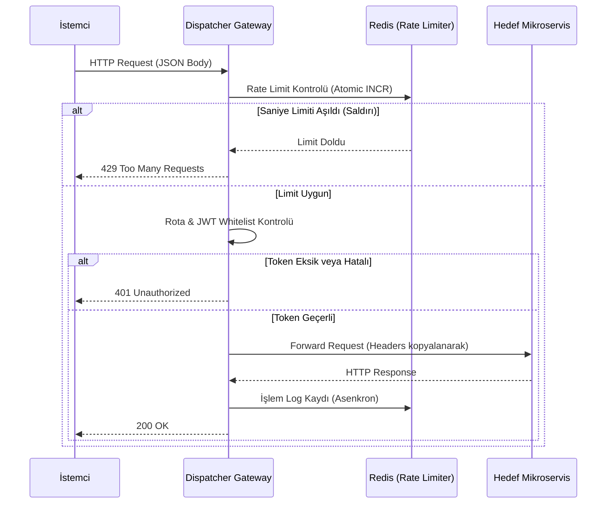
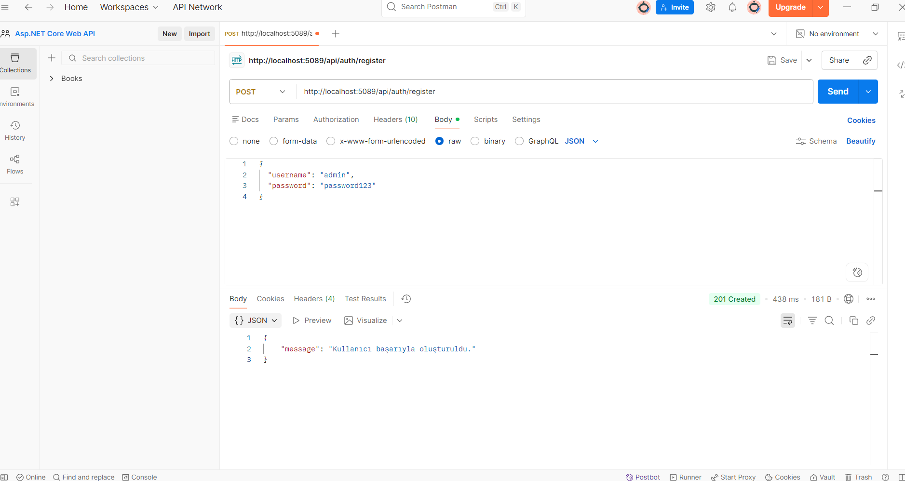
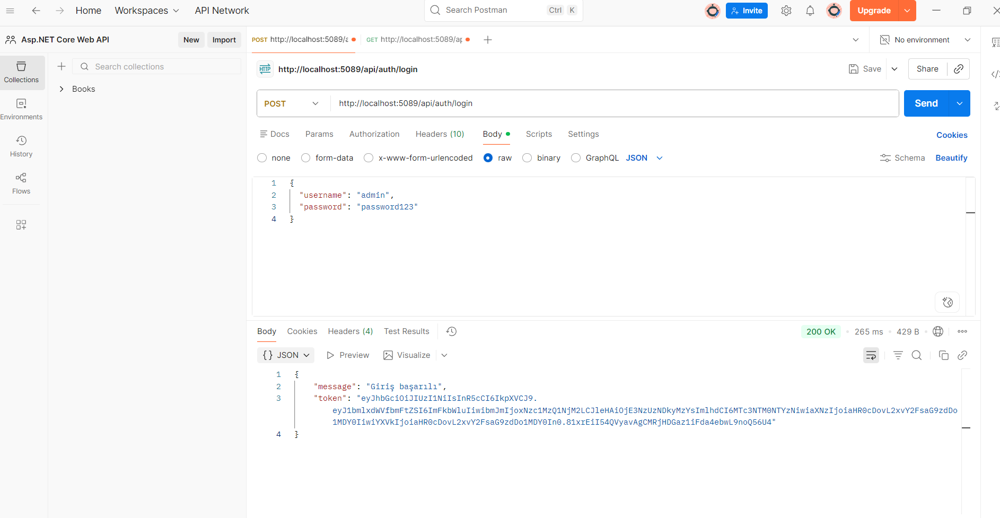
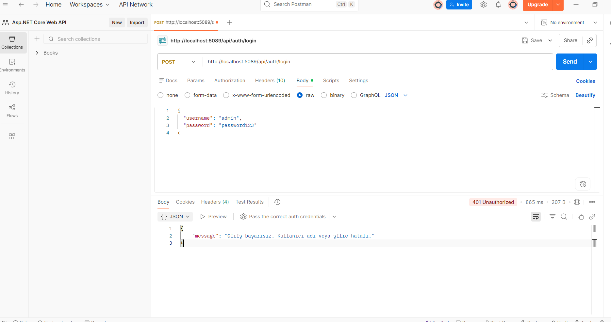
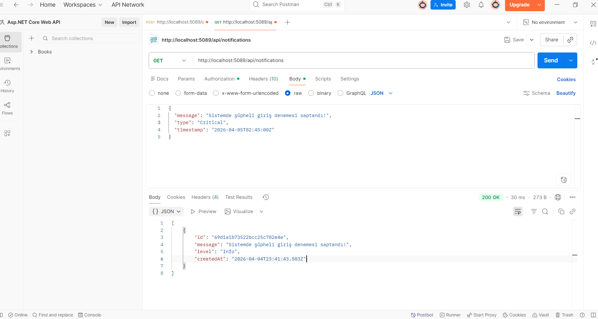
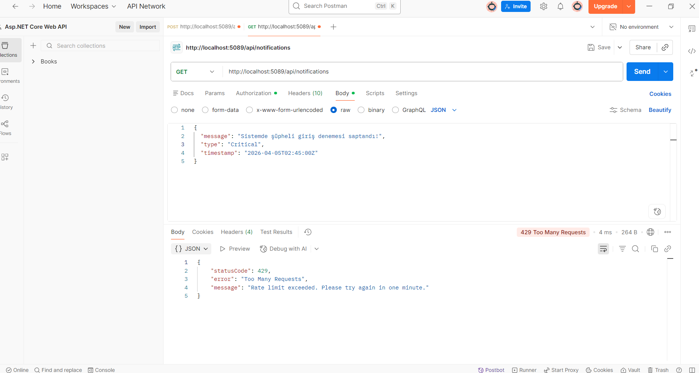
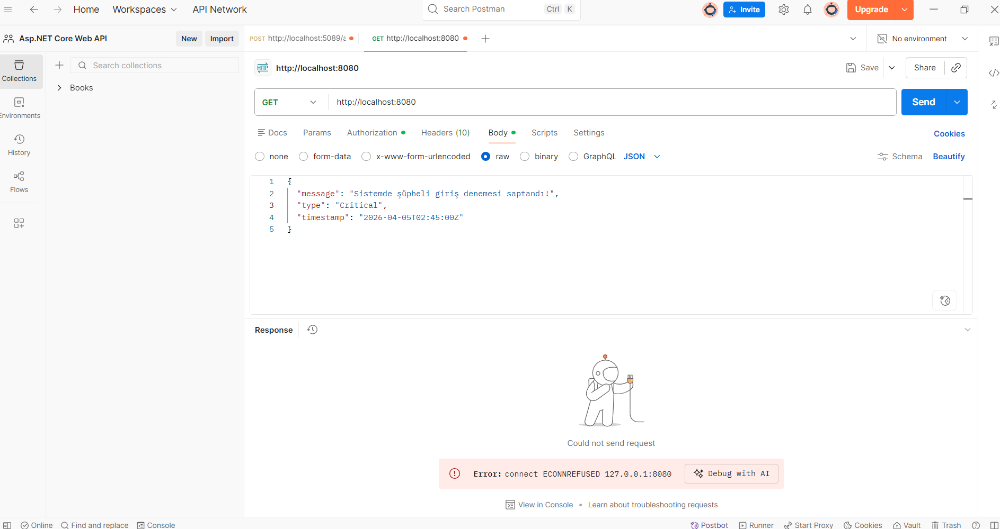
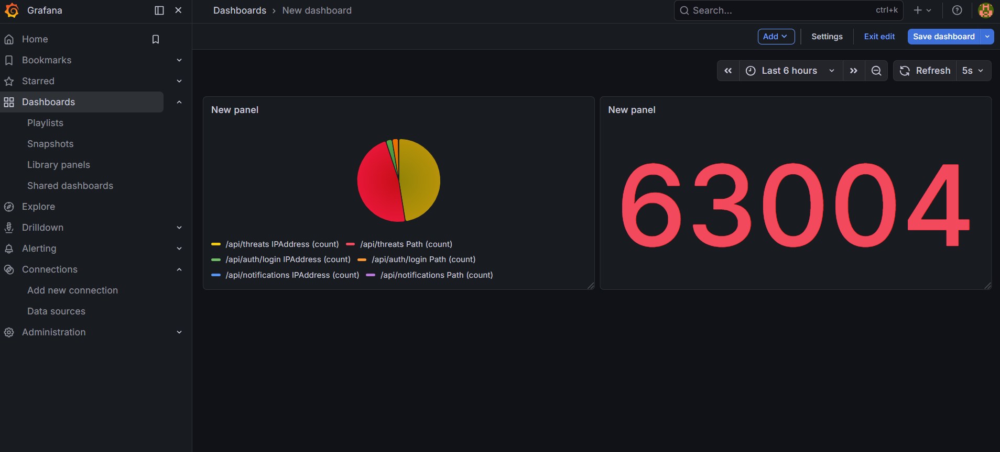

# 🛡️ Mikroservis Orkestratörü ve Güvenlik Gateway Sistemi — Proje Raporu
 
**Proje Adı:** Mikroservis Orkestratörü ve Güvenlik Gateway Sistemi  
**Ekip Üyeleri:** Fatih Bilgin - 231307019, Efe Aydın - 231307010  
**Tarih:** 5 Nisan 2026  
**Ders:** Yazılım Geliştirme Laboratuvarı II  
**Kurum:** Kocaeli Üniversitesi Teknoloji Fakültesi, Bilişim Sistemleri Mühendisliği  
 
---
 
## 1. Giriş
 
### 1.1 Problemin Tanımı
 
Dağıtık mikroservis mimarilerinde servislerin dış dünyaya doğrudan açık olması; DDoS saldırıları, brute-force girişimleri ve kontrolsüz trafik gibi ciddi güvenlik riskleri barındırır. Geleneksel monolitik yapılar bu saldırılar altında tamamen çökerken, mikroservis yapılarında her servisin kendi güvenliğini ve loglamasını bireysel olarak yönetmesi kod tekrarına ve yönetim zorluğuna yol açmaktadır.
 
Merkezi bir denetim mekanizmasının (Dispatcher) eksikliği, sistemin izlenebilirliğini (observability) ve savunma kapasitesini düşürmektedir.
 
### 1.2 Amaç
 
Bu projenin amacı; kullanıcıların güvenli bir şekilde sisteme kayıt olup giriş yapabildiği, tüm mikroservis trafiğini tek bir noktadan yöneten, **Test-Driven Development (TDD)** disipliniyle geliştirilmiş, yüksek performanslı bir API Gateway (Dispatcher) inşa etmektir.
 
Sistem;
- Rate Limiting ile saldırıları engeller  
- JWT ile kimlik doğrulaması yapar  
- Ağ izolasyonu ile servisleri korur  
- Redis üzerinden logları Grafana SOC paneline aktarır  
 
---
 
## 2. Sistem Tasarımı ve Mikroservisler
 
### 2.1 RESTful Servisler ve API Yapısı
 
Sistem, bir Gateway ve 3 mikroservisten oluşmaktadır.
 
| Servis | Metot | Endpoint | Açıklama |
| :--- | :--- | :--- | :--- |
| **AuthLogService** | POST | `/api/auth/register` | Kullanıcı kaydı (BCrypt) |
| **AuthLogService** | POST | `/api/auth/login` | JWT üretimi |
| **ThreatAlertService** | GET | `/api/threats` | Tehdit listesi |
| **NotificationService** | POST | `/api/notifications` | Bildirim oluştur |
| **NotificationService** | GET | `/api/notifications` | Bildirim listele |
 
---
 
### 2.2 Richardson Olgunluk Modeli (RMM)
 
Projemizdeki API tasarımı, endüstri standardı olan RMM ölçeğinde **Seviye 2** olgunluğundadır:
 
* **Seviye 1 (Resources):** API uç noktaları eylem bildiren fiiller yerine, kaynak bildiren isimler (`/auth`, `/threats`, `/notifications`) kullanılarak ayrıştırılmıştır.
* **Seviye 2 (HTTP Verbs):** Veri okuma işlemleri için `GET`, yeni kayıt oluşturma işlemleri için `POST` metotları kullanılmış; yanıtlar gerçek HTTP durum kodları ile standartlaştırılmıştır:
  * `200 OK` / `201 Created` (Başarılı işlemler)
  * `401 Unauthorized` (Eksik veya geçersiz JWT)
  * `415 Unsupported Media Type` (Yanlış içerik tipi)
  * `429 Too Many Requests` (Rate limit aşımı)
  * `500 Internal Server Error` (Sunucu bazlı hatalar)
 
---
 
### 2.3 Sistem Mimarisi
 
Aşağıdaki diyagram, istemciden gelen bir isteğin iç ağa (Docker Network) nasıl aktarıldığını ve servislerin birbirleriyle iletişimini göstermektedir.
 

### 2.4 İstek Akış Diyagramı
 

 
### 3. Algoritmalar ve Karmaşıklık Analizi
 
| İşlem          | Algoritma                     | Karmaşıklık | Açıklama                  |
|----------------|------------------------------|------------|---------------------------|
| Rate Limit     | Fixed Window (Redis INCR)    | O(1)       | $O(1)$Saniyedeki istek sayacı doğrudan RAM üzerinde tutulduğu için veri boyutu artsa bile hız sabit kalır.        |
| Loglama        | Redis RPUSH                  | O(1)       | Logların listeye eklenmesi asenkron yapıldığı için Gateway ana thread'ini (HTTP Request) bloklamaz.                  |
| DB Arama       | B-Tree                       | O(log n)   | $Kullanıcı adı veya ID sorguları, Mongo'nun B-Tree indekslemesi sayesinde logaritmik sürede bulunur.             |
| JWT Doğrulama  | HMAC-SHA256                  | O(1)       | $O(1)$Token içerisindeki verinin imzası, string uzunluğu sabit olduğu için sabit sürede hesaplanıp doğrulanır.               |
| Routing        | Prefix Match                 | O(m)       | Gelen URI isteği, sistemdeki kayıtlı $m$ adet rotanın başlıklarıyla eşleştirilerek yönlendirilir.           |
 
 
## 4. Proje Yapısı ve Modüller
  Sistem, docker-compose orkestrasyonu kullanılarak ayağa kalkan modüler bir yapıya sahiptir.
### 4.1 Dispatcher Gateway
Sistemin dış dünyaya açılan tek giriş noktasıdır. Üzerindeki middleware'ler sayesinde istekleri filtreler.
 
JwtAuthMiddleware: Gelen isteklerde yetki kontrolü yapar, /auth/login gibi uç noktaları es geçer.
 
RateLimitMiddleware: Belirli IP'lerden gelen yoğun trafikleri engeller.
 
RouterService: [FromBody] json verilerini ve Content-Type header'larını koruyarak gelen paketi ilgili servise paslar (Reverse Proxy).
 
### 4.2 AuthLogService
Kullanıcıların sisteme giriş çıkışlarını yönetir. Güvenlik zafiyeti oluşmaması adına şifreleri veritabanına açık metin (plain-text) olarak değil, BCrypt algoritmasıyla hash'leyerek kaydeder. Doğrulama başarılı olduğunda imzalı JWT üretir.
 
### Notification & Threat Services
Sistemin iş mantığını (Business Logic) yürüten arka uç servisleridir. Her birinin kendine ait bağımsız bir MongoDB veritabanı vardır (Database-per-service pattern). Dış ağdan erişimleri kapalıdır.
 
### Redis & Grafana
Redis, hem Rate Limiter sayaçlarını RAM'de tutmak için önbellek hem de log kuyruğu olarak kullanılır. Grafana ise bu verileri okuyarak anlık grafikler çizer ve sistemi görsel olarak izlememizi sağlar.
 
## 5. Test Senaryoları
Sistemin hata yönetimi, entegrasyonu ve güvenlik duvarları Postman ile test edilmiştir. Aşağıda bu testlere ait ekran görüntüleri bulunmaktadır.
 
### 5.1 Register
- POST /api/auth/register
- Kullanıcı oluşturulur
- Yeni bir kullanıcının sisteme başarıyla kaydedilmesi işlemi test edilmiştir. Şifreler DB'ye hashli yazılmaktadır.
  
 
### 5.2 Login
- JWT token üretilir
- Kayıtlı kullanıcı bilgileri Gateway üzerinden gönderilmiş, doğrulamadan geçen kullanıcıya Base64 ile kodlanmış geçerli bir JWT Token atanmıştır.

 
### 5.3 Unauthorized (401)
- Token yok → erişim reddedilir
- Bir saldırganın veya yetkisiz kullanıcının token olmadan sistemin korumalı /api/notifications uç noktasına erişimi denenmiş, sistem HTTP 401 kodu ile erişimi engellemiştir.

 
### 5.4 Authorized (200)
- Token ile başarılı erişim
- Yetkili kullanıcının sahip olduğu JWT Token, isteğe Authorization: Bearer <token> formatında header olarak eklenmiş ve servislerden başarılı veri dönüşü sağlanmıştır.

 
### 5.5 Rate Limit (429)
- Fazla istek → bloklanır
- Sisteme sanal olarak çok yüksek hızda ardışık istekler (Postman üzerinden seri gönderim) yollanmış, Gateway durumu tespit edip saniye limitini aşan istekleri mikroservislere ulaştırmadan bloklamıştır.

 
### 5.6 Network Isolation
- Direkt servis erişimi → reddedilir
- Docker iç ağında koşan mikroservislere (örn: Notification servisi 8080 portu) doğrudan dış tarayıcı veya Postman üzerinden erişilmeye çalışılmış, sistem "Connection Refused" (Bağlantı Reddedildi) vererek güvenliği doğrulamıştır.

 
### 5.7 Grafana SOC
- Tüm trafik canlı izlenir
- Sistem üzerinde yapılan tüm başarılı işlemler ve Rate Limit bloklamaları canlı olarak Redis'e akmış, bu veriler Grafana üzerinde güvenlik istatistikleri ve pasta grafikler olarak izlenmiştir.

 
## 6. Sonuç ve Tartışma
 
### Başarılar
- Merkezi Gateway mimarisi
- Güvenlik (JWT + Rate Limit)
- Ağ izolasyonu
- Grafana ile izlenebilirlik
 
### Karşılaşılan Problemler
- 415 Unsupported Media Type
- 500 Internal Server Error
- Header forwarding problemleri
 
### Geliştirme Önerileri
- Gateway ve mikroservisler arası mevcut senkron iletişim altyapısına, yoğun veri aktarımlarında veri kaybını önlemek için RabbitMQ veya Apache Kafka gibi asenkron mesaj kuyruk mimarileri entegre edilebilir.
- API'nin olgunluk seviyesini artırmak için Richardson Modelinin 3. Seviyesi olan HATEOAS (Hypermedia as the Engine of Application State) standardı eklenebilir.
- Docker Compose ile çalışan yapı, ileride otomatik ölçeklendirme (Auto-scaling) ve yük dengeleme (Load Balancing) yetenekleri kazanması adına Kubernetes (K8s) kümesine taşınabilir.
 
## Genel Değerlendirme
 
Bu proje, modern mikroservis mimarisinde aşağıdaki konuları başarılı şekilde ele alan bir sistem ortaya koymuştur:
 
- Güvenlik
- Performans
- İzlenebilirlik
